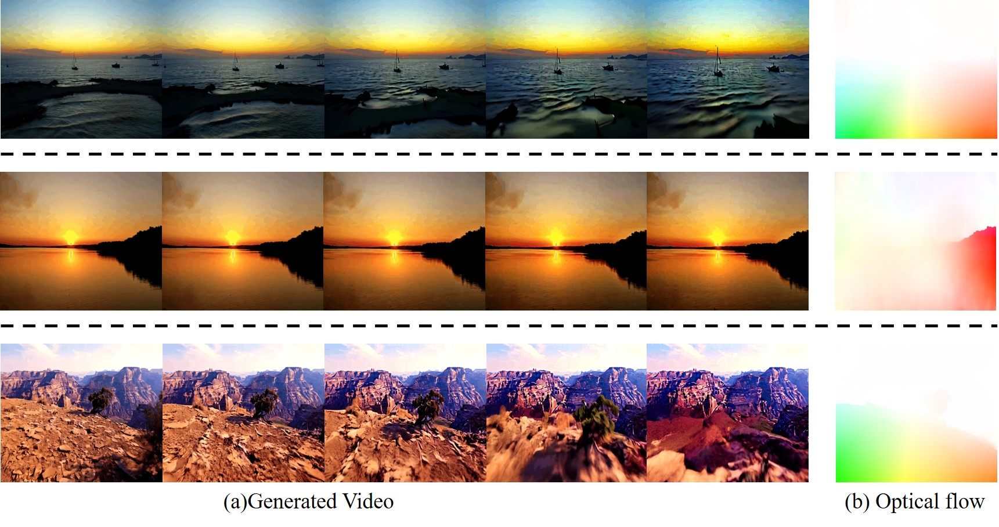

# Motion-Catcher

"Motion-Catcher: upholding motion and content consistency in extended video sequences"

<p align="center">
 
<br>
<em>Motion-Catcher maintains strong consistency across multiple video sequences. </em>
</p>


###  Requirements

```shell
conda create -n MotionCatcher python=3.10
conda activate MotionCatcher
pip install -r requirements.txt
```

## Inference

To perform image-to-video generation, just run this command:
```bash
python experiments.py \
    --image_path "./experiments/datasets/t2i_625" \
    --output_path "outputvideo/output" \
    --video_clip 5 \
    --width 1024 \
    --height 576 \
    --numframe 14 \
    --decode_chunk_size 8 \
```
Args:
- `--image_path` specifies the directory containing the input images.
- `--output_path` sets the directory where the generated video will be saved.
- `--video_clip` sets the video clip number.
- `--width` and `--height` set the resolution of the output video.
- `--numframe` defines the total number of frames in per video clip.
- `--decode_chunk_size` sets the number of frames to decode at once, which can optimize memory usage during video generation.

## Visualizations-Zeroshot

On the left is the original multi-sequence stitching effect, and on the right is the corrected video sequence

<table>
  <tr>
    <th>Before</th>
    <th>After</th>
  </tr>
  <tr>
    <td></td>
    <td></td>
  </tr>
</table>

<table>
  <tr>
    <th>Before</th>
    <th>After</th>
  </tr>
  <tr>
    <td></td>
    <td></td>
  </tr>
</table>

<table>
  <tr>
    <th>Before</th>
    <th>After</th>
  </tr>
  <tr>
    <td></td>
    <td></td>
  </tr>
</table>

<table>
  <tr>
    <th>Before</th>
    <th>After</th>
  </tr>
  <tr>
    <td></td>
    <td></td>
  </tr>
</table>

<table>
  <tr>
    <th>Before</th>
    <th>After</th>
  </tr>
  <tr>
    <td></td>
    <td></td>
  </tr>
</table>

<table>
  <tr>
    <th>Before</th>
    <th>After</th>
  </tr>
  <tr>
    <td></td>
    <td></td>
  </tr>
</table>


# Acknowledgement
This repository borrows heavily from [Diffusers](https://github.com/huggingface/diffusers), [ControlNet](https://github.com/lllyasviel/ControlNet), thanks for open-sourcing! 
